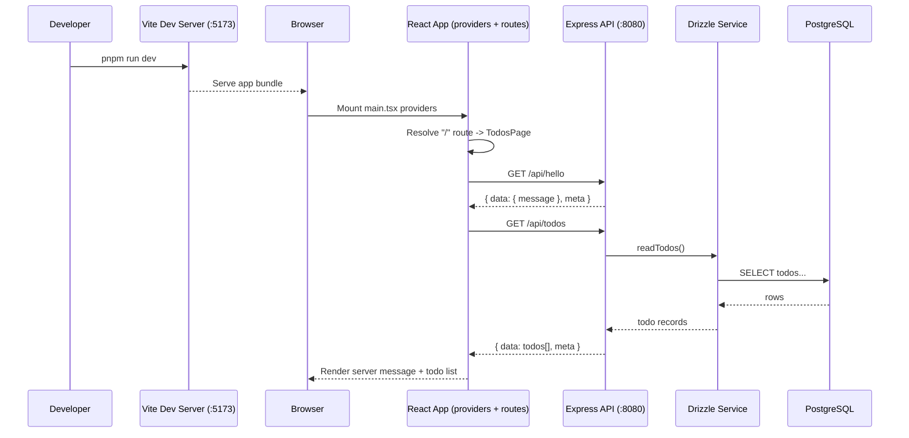
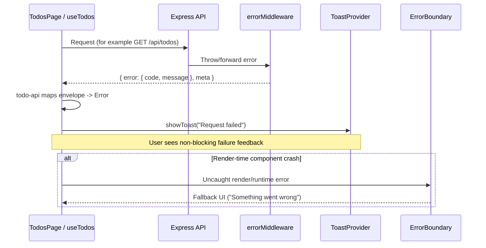

# App Startup Walkthrough

This guide explains what happens from `pnpm run dev` to the first successful render in the browser.

## Preconditions

- Dependencies installed (`pnpm install`)
- Environment file present (`server/.env`)
- PostgreSQL running
- Database initialized (for example `pnpm run db:import` or `pnpm run db:migrate && pnpm run db:seed`)

## 1) Start Dev Processes

Run:

```sh
pnpm run dev
```

This starts two watchers in parallel:

- `dev:client` -> `pnpm -C client dev` (Vite dev server, usually `http://localhost:5173`)
- `dev:server` -> `pnpm -C server dev` (`tsx watch server.ts`, usually `http://localhost:8080`)

## 2) Server Bootstrap (Node/Express)

File flow:

1. `server/server.ts` imports:
   - `env` from `server/config/env.ts` (runtime env validation)
   - `createApp()` from `server/app.ts`
2. `createApp()` composes middleware in order:
   - `helmet`
   - `cors` (origin allowlist from `CORS_ORIGIN`)
   - static file serving (`client/dist`, `server/public`)
   - request logging (`httpLogger`, request IDs)
   - JSON body parser
   - API read/write rate limiters
   - `/api` routes
   - SPA fallback route (`index.html`)
   - centralized `errorMiddleware`
3. `app.listen(env.PORT)` starts the HTTP listener.

## 3) Client Bootstrap (React/Vite)

File flow:

1. Browser opens `http://localhost:5173`
2. `client/src/main.tsx` initializes React root and wraps app with:
   - `ErrorBoundary`
   - `ToastProvider`
   - `BrowserRouter`
   - `AppStateProvider` (Context + reducer)
3. `client/src/App.tsx` renders app shell + route config.
4. Route-level pages are lazy-loaded (`TodosPage`, `AboutPage`) with `Suspense`.

## 4) Initial Route Render (`/`)

For the default route:

1. `TodosPage` mounts.
2. `useTodos()` runs its initial `useEffect`.
3. `useTodos()` requests:
   - `GET /api/hello`
   - `GET /api/todos`
4. Responses are parsed through `client/src/features/todos/todo-api.ts`.
5. Page updates:
   - header status message
   - todo list
   - counts/badges

## Startup Sequence Diagram



## Error Path Diagram



## 5) Backend Request Path (example: `GET /api/todos`)

Request path:

1. Express receives request under `/api/todos`
2. Router (`server/routes/api.ts`) selects handler
3. Controller (`server/controllers/todo-controller.ts`) invokes service
4. Service (`server/services/todo-service.ts`) uses Drizzle client
5. Drizzle queries PostgreSQL
6. Controller returns standardized API envelope:
   - success: `{ data, meta: { requestId } }`
   - error: `{ error: { code, message, details? }, meta: { requestId } }`

## 6) What Happens on Errors

- Server:
  - All uncaught errors go through `errorMiddleware`
  - Errors become normalized API envelopes with status codes
- Client:
  - API layer throws readable errors
  - `TodosPage` shows toast notifications for failures
  - `ErrorBoundary` catches render-time crashes and shows fallback UI

## 7) Health vs Readiness

- `GET /api/health`
  - Liveness-style endpoint
  - Returns `200` when app is running
- `GET /api/ready`
  - Readiness-style endpoint
  - Returns `503` when DB is unavailable/not configured

## 8) Quick Debug Checklist

If app does not load data:

1. Confirm `pnpm run dev` is running.
2. Check server log for startup line (`Listening on port ...`).
3. Hit endpoints manually:
   - `http://localhost:8080/api/hello`
   - `http://localhost:8080/api/health`
   - `http://localhost:8080/api/ready`
4. Verify `DATABASE_URL` and DB state.
5. Use `pnpm run dev:fresh` if stale local processes are suspected.
