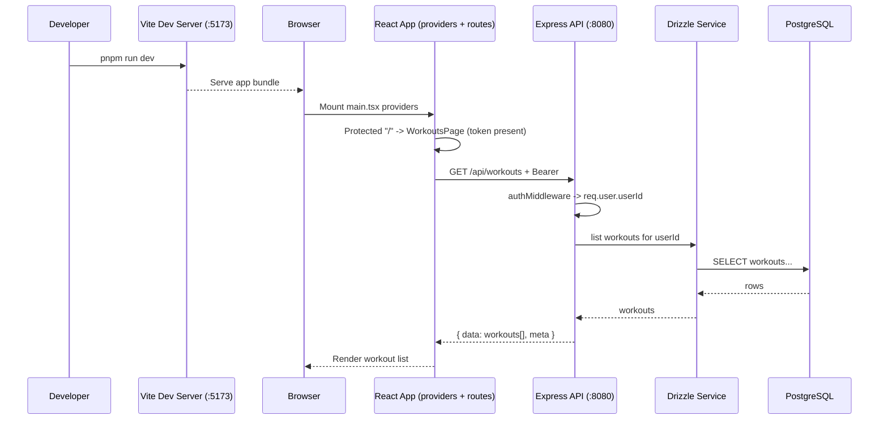
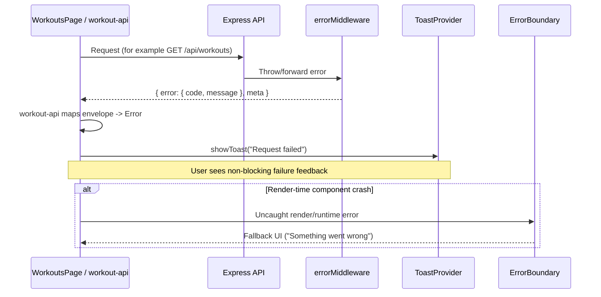

# App Startup Walkthrough

This guide explains what happens from `pnpm run dev` to the first successful render in the browser.

## Preconditions

- Dependencies installed (`pnpm install`)
- Environment file present (`server/.env`)
- PostgreSQL running
- Database initialized (for example `pnpm run db:import` or `pnpm run db:migrate && pnpm run db:seed`)

## 1) Start Dev Processes

Run:

```sh
pnpm run dev
```

This starts two watchers in parallel:

- `dev:client` -> `pnpm -C client dev` (Vite dev server, usually `http://localhost:5173`)
- `dev:server` -> `pnpm -C server dev` (`tsx watch server.ts`, usually `http://localhost:8080`)

## 2) Server Bootstrap (Node/Express)

File flow:

1. `server/server.ts` imports:
   - `env` from `server/config/env.ts` (runtime env validation)
   - `createApp()` from `server/app.ts`
2. `createApp()` composes middleware in order:
   - `helmet`
   - `cors` (origin allowlist from `CORS_ORIGIN`)
   - static file serving (`client/dist`, `server/public`)
   - request logging (`httpLogger`, request IDs)
   - JSON body parser
   - API read/write rate limiters
   - `/api` routes
   - SPA fallback route (`index.html`)
   - centralized `errorMiddleware`
3. `app.listen(env.PORT)` starts the HTTP listener.

## 3) Client Bootstrap (React/Vite)

File flow:

1. Browser opens `http://localhost:5173`
2. `client/src/main.tsx` initializes React root and wraps app with:
   - `ErrorBoundary`
   - `ToastProvider`
   - `BrowserRouter`
   - `AppStateProvider` (Context + reducer)
3. `client/src/App.tsx` renders `AuthProvider`, app shell, and route config.
4. Route-level pages are lazy-loaded (`WorkoutsPage`, `SignInPage`, etc.) with `Suspense`.

## 4) Initial navigation (unauthenticated)

If there is no stored access token:

1. User opens `/` (workouts).
2. `ProtectedRoute` detects missing auth and **redirects** to `/sign-in`.
3. `SignInPage` offers demo sign-up / sign-in (display name).

## 5) After sign-in (`/` workouts list)

1. `AuthProvider` stores the JWT (see `client/src/lib/auth-storage.ts`).
2. `WorkoutsPage` loads inside `ProtectedRoute`.
3. The page requests **`GET /api/workouts`** with **`Authorization: Bearer <token>`** (via `client/src/lib/workout-api.ts`).
4. Server: `authMiddleware` verifies JWT and sets **`req.user.userId`**; `workout-service` returns only that user’s workouts.
5. UI renders the list.

## Startup sequence diagram (authenticated list)



## Error path diagram



## 6) Backend request path (example: `GET /api/workouts`)

1. Express receives `GET /api/workouts`.
2. Router (`server/routes/api.ts`) runs **`authMiddleware`** then `getWorkouts`.
3. Controller reads **`req.user.userId`** and calls `workout-service`.
4. Service queries Drizzle with a **user filter** (see **`docs/styleguide/security-and-authz.md`**).
5. Response uses the standard envelope (`data` / `error` + `meta.requestId`).

## 7) What happens on errors

- **Server:** uncaught errors → `errorMiddleware` → envelope + status.
- **Client:** API helpers throw; pages may show toasts; `ErrorBoundary` catches render crashes.

## 8) Health vs Readiness

- `GET /api/health`
  - Liveness-style endpoint
  - Returns `200` when app is running
- `GET /api/ready`
  - Readiness-style endpoint
  - Returns `503` when DB is unavailable/not configured

## 9) Quick debug checklist

If app does not load data:

1. Confirm `pnpm run dev` is running.
2. Check server log for startup line (`Listening on port ...`).
3. Hit endpoints manually:
   - `http://localhost:8080/api/hello`
   - `http://localhost:8080/api/health`
   - `http://localhost:8080/api/ready`
4. Verify `DATABASE_URL`, run **`pnpm run db:migrate`** / **`pnpm run db:seed`** if tables are empty.
5. For authenticated UI, confirm sign-in returns a token and **`GET /api/workouts`** succeeds with `Authorization: Bearer ...`.
6. Use `pnpm run dev:fresh` if stale local processes are suspected.
