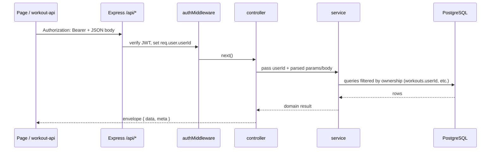

# Data flow

How data moves through **workout-tracker** for the common paths: demo auth, workouts, sets, and stats. For layering rules see **`architecture.md`**; for **authorization** see **`docs/styleguide/security-and-authz.md`**.

## 1. Demo sign-up / sign-in

```mermaid
sequenceDiagram
  participant UI as SignInPage
  participant API as POST /api/auth/sign-up|sign-in
  participant Auth as auth-controller → auth-service
  participant DB as PostgreSQL

  UI->>API: JSON { displayName }
  API->>Auth: validate (Zod), signUpDemo / signInByDisplayName
  Auth->>DB: insert users + profiles / join profiles + users
  DB-->>Auth: user row
  Auth-->>API: JWT (userId in payload)
  API-->>UI: { token, userId, displayName, ... }
  UI->>UI: auth-storage saves token; AuthContext updates me
```

- **Token:** signed with **`TOKEN_SECRET`**, payload `{ userId }` (see `server/lib/authorization-middleware.ts`).
- **Conflicts:** duplicate display name → **409** (`profiles_display_name_unique`).

## 2. Authenticated API calls



- **Rule:** `userId` for authorization is **only** from `req.user`, never from the client body for tenancy (see styleguide).

## 3. Workout and sets

- **List/create workouts:** `GET/POST /api/workouts` → `workout-service` scopes by `userId`.
- **Detail / patch / delete workout:** `workoutId` in path; service loads workout and asserts `workout.userId === req.user.userId` (or equivalent).
- **Add set:** `POST /api/workouts/:workoutId/sets` → verifies workout ownership, then `exerciseTypeId` usable (global or same user’s custom).
- **Patch/delete set:** `setId` → resolve set → workout → user.

## 4. Weekly volume stats

- **`GET /api/stats/weekly-volume?weekStart=YYYY-MM-DD`**
- **Window:** UTC `[weekStart, weekStart + 7d)` on **`workouts.startedAt`** (see **`docs/assumptions.md`**).
- **Metric:** sum over sets on those workouts: **reps × weight** (`server/lib/volume.ts`).

## 5. Exercises

- **`GET /api/exercises`:** global rows (`userId` null) plus current user’s custom rows.
- **`POST /api/exercises`:** creates a user-scoped row; service enforces no duplicate name per user for custom exercises.

## 6. Client persistence

| Data                   | Where                               | Notes                                  |
| ---------------------- | ----------------------------------- | -------------------------------------- |
| Access token           | `localStorage` (via `auth-storage`) | Cleared on sign-out                    |
| Current user summary   | `AuthContext`                       | From `GET /api/me` after token present |
| Workout lists / detail | Component state + refetch           | No global server-state library yet     |

## 7. PWA (light)

- **`/manifest.webmanifest`** — install metadata with **PNG** icons **`/icon-192.png`** and **`/icon-512.png`** (see **`pnpm run pwa:icons`**).
- **Production-only** service worker (`/sw.js`) — activation only; **no offline API cache** (avoids stale workout data). See `client/src/main.tsx` registration.
- **HTTPS** required for SW outside localhost.

## Related files

| Concern             | Location                                                                    |
| ------------------- | --------------------------------------------------------------------------- |
| Routes + middleware | `server/routes/api.ts`                                                      |
| JWT                 | `server/lib/authorization-middleware.ts`, `server/services/auth-service.ts` |
| Client API          | `client/src/lib/workout-api.ts`                                             |
| Auth UI             | `client/src/features/auth/*`                                                |
