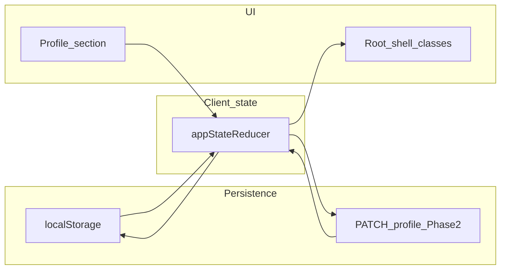

# Proposal: Display and accessibility settings

**Status:** **In progress** — Phase 1 (local shell + Profile) underway; Phase 2 (server-backed) pending.

**Audience:** maintainers, Cursor agents  
**Related app:** [workout-tracker](../../README.md) (repo root)  
**Also read:** [docs/styleguide/ui-styleguide.md](../styleguide/ui-styleguide.md), [docs/styleguide/README.md](../styleguide/README.md)

## 1. Goal

Ship **app-shell** display controls for workout-tracker:

- **Text size** (scaled typography across the UI).
- **Dark mode** and **high contrast** (global surfaces, aligned with accessible contrast).

**Phase 1:** `localStorage` + root CSS classes + Profile UI (matches the parent app’s _shell_ pattern, not the Bible **reader** feature).  
**Phase 2:** **Server-backed** preferences on `profiles` (JSON column) for **cross-device sync**, extending `PATCH /api/profile` and `GET /api/me`.

## 2. What exists in the parent workspace (applies here)

**Reuse the “app shell” model, not the reader feature.**

When the repo lives next to the parent **bible-support** client, mirror patterns from the parent `client/` tree: `app-state-store` (`textScale`, `highContrast`, `darkMode`), `AppStateProvider` hydration/persistence, root wrapper classes in `App.tsx`, and `index.css` rules for `.app-text-scale-*`, `.app-dark-mode`, `.app-high-contrast`.

| Parent piece                | Apply to workout-tracker?                                                                                                                                      |
| --------------------------- | -------------------------------------------------------------------------------------------------------------------------------------------------------------- |
| `AppState` + reducer        | **Yes** — replace noop [client/src/state/app-state-store.ts](../../client/src/state/app-state-store.ts)                                                        |
| `localStorage` hydrate/sync | **Yes** — [client/src/state/AppStateProvider.tsx](../../client/src/state/AppStateProvider.tsx) (optional `wt-` key prefix if two apps share an origin locally) |
| Root classes on shell       | **Yes** — [client/src/App.tsx](../../client/src/App.tsx)                                                                                                       |
| Typography + override CSS   | **Yes** — extend [client/src/index.css](../../client/src/index.css); **omit** reader-only blocks (`.reader-root`, `.reader-theme-*`, …)                        |
| Display UI in nav modal     | **Reimplement** — use a **Profile** “Display & accessibility” section (simpler nav than parent)                                                                |

**Do not port:** `ReaderOptionsModal`, reader preferences, server `reader_state`, or reader-specific copy.

**Precedence:** `highContrast` wins over `darkMode` when both are enabled (same as parent shell).

## 3. Design fit (workout-tracker)

- **Palette:** Mostly **slate** + **indigo** primaries + **amber** accents. Parent-style attribute selectors for `slate` / `white` help `Card`, `Input`, `NavLinkButton`; add explicit **indigo** and **amber** overrides for dark and high-contrast modes.
- **Light shell:** Keep **bg-slate-50** as default; dark shell **bg-slate-950** + light text.
- **Primitives:** Verify **Select**, **Textarea**, **ToastProvider** after global CSS lands.

## 4. Implementation outline

**Order:** **Phase 1** first, then **Phase 2**, unless both ship in one PR intentionally.

1. **State** — `TextScale`, `highContrast`, `darkMode` + actions; hydrate/persist in `AppStateProvider`; document keys in `AGENTS.md` or `docs/configuration.md` if needed.
2. **Hooks** — Export `useAppState` / `useAppDispatch` from `@/state` if missing.
3. **Shell** — `App.tsx`: compute `textScaleClassName` + `contrastClassName`; wrap `<main>` so sign-in and about share the same treatment.
4. **Nav** — `navClassName` (or equivalent) for dark/high-contrast; prefer **class-based** `.app-dark-mode` overrides over Tailwind `darkMode: 'class'` unless already configured.
5. **CSS** — Port trimmed parent rules: scale vars, `.app-text-scale-*` + Tailwind text remaps, mobile `select` sizing, `.app-high-contrast` / `.app-dark-mode`; add indigo/amber; respect Stylelint ordering.
6. **Profile UI** — Dark mode, high contrast, text size (`sm`–`xl`), optional reset to defaults.
7. **Reduced motion (optional)** — `prefers-reduced-motion` CSS and/or a later persisted flag.
8. **Quality** — `pnpm run ci:local`; Vitest (storage, root classes, HC vs dark precedence); axe / `e2e/a11y.spec.ts`; `CHANGELOG.md` + `ui-styleguide.md`.

## 5. Should also cover

- **`color-scheme`** on `html` or root for native scrollbars/controls in dark vs light.
- **Focus rings** on dark backgrounds (ring offset / color); document in styleguide.
- **FOUC (optional):** inline script in `index.html` reading the same keys before bundle load.
- **Screen readers:** prefer native controls; optional `aria-live` if using custom Apply flows.
- **SignInPage** QA in dark + high contrast (OIDC, demo, guest).
- **PWA `theme_color`:** document limitation or pick a neutral value.
- **E2E:** set preference → reload → assert class or persistence.

## 6. Phase 2: Server-backed display preferences

**Goal:** Persist the same shape on the server for signed-in users across devices.

- **Schema:** Nullable **`jsonb`** on `profiles` (e.g. `uiPreferences`): `{ textScale?, highContrast?, darkMode? }`. Drizzle + migration + journal per DB gate.
- **Validation:** Zod on the server; consistent handling of unknown keys.
- **API:** Extend **`PATCH /api/profile`** with optional `uiPreferences` (document **merge vs replace**; merge is usually better). Return `uiPreferences` on **`GET /api/me`** (or existing profile payload).
- **Client:** After `me` loads, dispatch into app state; optionally mirror to `localStorage`. PATCH on change (debounced or Apply); toast on failure.
- **Guests:** Either same as named users or local-only for guests — **document the choice**.
- **Tests:** API merge + GET; E2E or integration for cross-session consistency.

## 7. Optional later

- **System theme:** `prefers-color-scheme: dark` as default or “Auto” before user override.

## 8. Execution checklist

- [ ] Phase 1: state + `localStorage` + shell + nav + CSS + Profile UI
- [ ] Phase 1: `color-scheme`, focus pass, Sign-in QA
- [ ] Phase 1: Vitest + ci:local + CHANGELOG + styleguide (+ optional Playwright)
- [ ] Phase 2: migration + Drizzle + Zod + PATCH/me + client merge
- [ ] Phase 2: tests + docs for cross-device behavior
